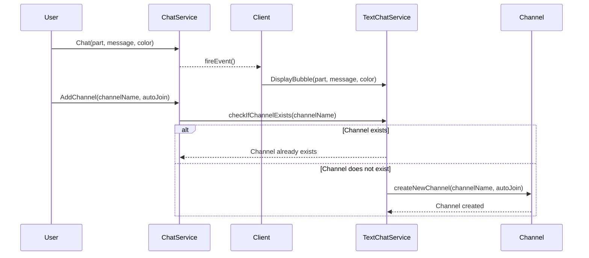

# ChatConnector Module

A module that connects the legacy Roblox chat system to the new `TextChatService`.

## Setup
Place this module in `ReplicatedStorage` and **require it at least once on the client** to enable chat functionality across all players.

## Functions

### `ChatConnector:Chat(partOrCharacter, message, color)`
Displays a text bubble above a part or character.

- **`partOrCharacter`** (Instance): Target instance (part or character model).
- **`message`** (string): Text to display.
- **`color`** (Color3, optional): Color for the text, default is black.

#### Example:
```lua
ChatConnector:Chat(workspace.SpawnLocation, "Hello!", Color3.fromRGB(0, 255, 0))  -- Green text
```


## Sequence diagram of flows:
